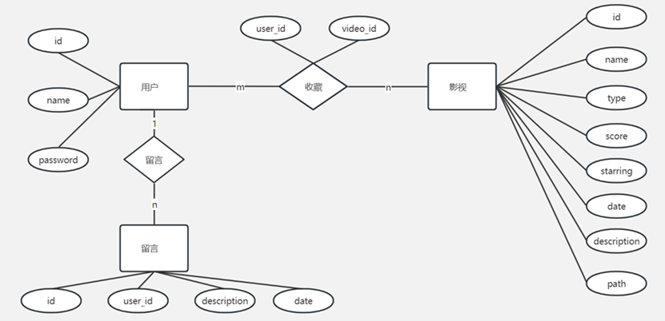

# MySQL-Video-Platform-Scripts
A collection of MySQL scripts for a video platform database, including table creation, data insertion, data querying, and data deletion.

## Task

1.	根据ER图，使用`CREATE`等语句建立“影视管理”数据库和相关表。
2.	使用MySQL语言语句，中文字符使用“utf8mb4”类型
    1.	在数据库各个表中插入多行数据，其数量满足b的要求（查询结果正反例各至少3）。
    2.	查找“留言”里留言为“（自己的学号）喜欢看动作电影”的用户中，收藏的影视平均score大于（自己的学号倒数第一个非零位）的用户名字。思考如何实现使得执行效率高（内存消耗、执行速度等）。
    3.	将ii中涉及的用户每个人的所有留言清空。
